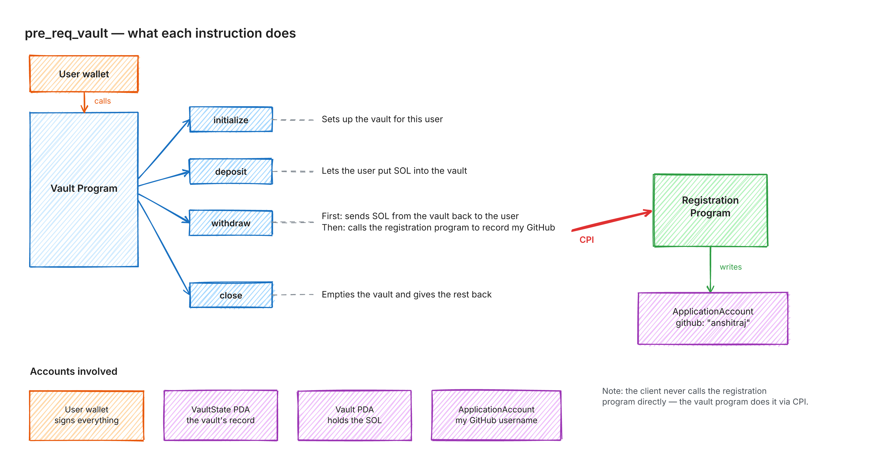

# pre-req-vault

Anchor SOL vault program. `withdraw` CPIs into a separate registration program
to record the withdrawer's GitHub username.

## Architecture



Live/editable: https://app.excalidraw.com/s/3Jh21Vg4eJS/5NY45NZw0Dd

## Proof (devnet)

- Program: [`HP5aJubMqSXKAgTqsNTTpYN3TQkcgLnSm5oUipUQCfhz`](https://explorer.solana.com/address/HP5aJubMqSXKAgTqsNTTpYN3TQkcgLnSm5oUipUQCfhz?cluster=devnet)
- Wallet used: [`5U8V4sH2W8z6yknRUeSscVr3eY1Le4JSq1rPWXHGJ3pc`](https://explorer.solana.com/address/5U8V4sH2W8z6yknRUeSscVr3eY1Le4JSq1rPWXHGJ3pc?cluster=devnet)
- ApplicationAccount created by the CPI: [`AT9P8ccRszsf9Gy7n9YMQVnWBpHR6ytYSLkSS6Kv9pAm`](https://explorer.solana.com/address/AT9P8ccRszsf9Gy7n9YMQVnWBpHR6ytYSLkSS6Kv9pAm?cluster=devnet) — `github: "anshitraj"`

Transactions:

| ix | signature |
|---|---|
| initialize | [4JYfxpNQ...Ud83](https://explorer.solana.com/tx/4JYfxpNQqxS2rx1wXG5XfQ3QyqHG7kqdzJW2oDgxeHZjHTdW9EpNcr3io64CEX7ywk18bEucJBeWHTrpxmB7Ud83?cluster=devnet) |
| deposit | [VnZMNTXy...LnjP](https://explorer.solana.com/tx/VnZMNTXyuEvgMWUELFS2B8WZZcNRwBuNkfqzKjoLgaftEKijB7o9Xo35jnZjRvbTxzMbGNEGcPY4GWgA1qjLnjP?cluster=devnet) |
| **withdraw** (CPI happens here) | [3nton82W...HgsQ](https://explorer.solana.com/tx/3nton82W2vkw7NiW21b5JzmqPVYB912LhK3xr9rryY7kMVJRYiUqSLC5eXZ8zxupTp2hGrBs7faU8837NUWHRgsQ?cluster=devnet) |
| close | [v5FHEnwR...5sb](https://explorer.solana.com/tx/v5FHEnwRBDeX6QUMxExppuT88YBeoBXD226WxUgjYyjRaA2Jma3SFV8rt23AWzed7HoGDvL4p6kDm7noyP2F5sb?cluster=devnet) |

`verify.mjs` decodes the ApplicationAccount directly to confirm the CPI wrote
`github: "anshitraj"`.

## Run it

```bash
anchor build && anchor keys sync
anchor deploy --provider.cluster devnet
anchor test --skip-build --skip-deploy --provider.cluster devnet
```
